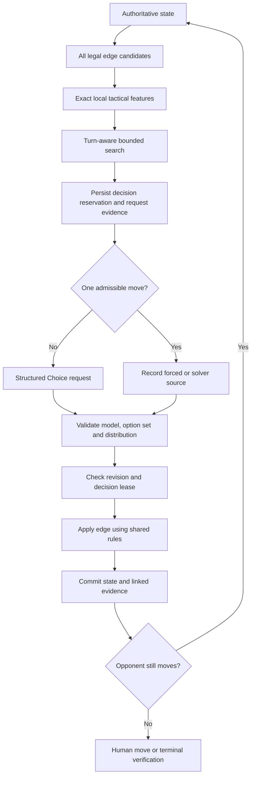

# Implementation architecture

## Rules

The visible game has five rows/columns of dots, creating 16 boxes. Horizontal edges are `row*n+col`; vertical edges start at `n*(n+1)` and are `offset+row*(n+1)+col`. The engine supports sizes 1–6 for verification, but hosted matches are fixed to four boxes per side.

The state is `{rulesVersion,size,firstPlayer,toMove,ply,edges,boxes}`. `null` is unclaimed; 0 is human, 1 is opponent. There are no bitwise 32-bit shortcuts that truncate the 40-edge board. A move fills one edge, checks adjacent boxes, claims every newly completed box and preserves the actor after a capture. Two captured boxes are two points—not two banked turns.

The same module serves the browser, backend, benchmarks, exports and independent replay tests.

## Decision loop

The feature extractor computes immediate captures, newly exposed third sides, next player, opponent capture opportunities, remaining safe edges and structural components. Components become `chain` or `loop` only when their open-edge degree/port conditions hold. Other positions remain `unclassified`.

Difficulty profiles are fixed data: Easy (features, no search), Normal (depth 2, 2,000 nodes), Hard (depth 4, 10,000), JEV (depth 6, 40,000, attempted completion when at most ten edges remain). Root candidates receive equal node budgets. Search follows the actual actor instead of alternating blindly after a capture.

At a cutoff, a deterministic capture-only continuation supplies an explicitly approximate evaluation. It does not finish an arbitrary whole board at each leaf. This changed from the initial full-rollout idea after timing exposed excessive work. No specialized handout formula is applied indiscriminately.

The highest profile may restrict JEV to proven optimal actions when every root candidate is exactly solved. Source labels distinguish `jev`, `local`, `fallback`, `forced` and `solver`. The implementation makes no unmeasured claim that the strongest-looking configuration is actually strongest; benchmark it.

## Match persistence

The database has users, sessions, OAuth flows, Discord launches, matches, quotas and operational events. Full per-match evidence is embedded in the bounded match record so state/journal updates use the same compare-and-swap operation. This is intentionally simpler than adding an event bus and multiple result tables to a 40-edge game.

An active match is unique per owner. Ranked attempts are sequenced within an immutable pool; starting seats alternate. One launch can be associated with one match only. Guild/channel columns come from a server-verified launch row.

`revision` counts committed gameplay edges. The database `version` changes for reservations and other record updates too. Concurrency checks must not confuse these two counters.

## Minimal API

| Route | Purpose |
|---|---|
| `GET /api/session` | Session bootstrap, CSRF, capabilities and active match |
| `GET /api/auth/discord` | Begin OAuth |
| `GET /api/auth/discord/callback` | Consume state/code and rotate session |
| `POST /api/logout` | Revoke session |
| `POST /api/session/context` | Redeem a fresh user-bound launch |
| `POST /api/discord/interactions` | Signature-verified command/PING |
| `POST /api/matches` | Create one authoritative match |
| `GET /api/matches/:id` | Owner-only authoritative snapshot |
| `POST /api/matches/:id/step` | Human action, opponent advance or resignation |
| `GET /api/matches/:id/events?after=N` | Owner-only incremental events, at most 100/page |
| `GET /api/matches/:id/export?format=...` | Full/replay/summary/JSONL/CSV/audit |
| `POST /api/matches/:id/telemetry` | Explicitly consented, allowlisted UI diagnostics |
| `GET /api/leaderboard` | World or verified community view |
| `GET /api/history` | Most recent 100 owned matches |
| `GET /api/analytics` | Summaries of most recent 100 owned matches |
| `GET /api/health` | Minimal application health response |

Mutation requests use an exact-origin check, session and CSRF token. Step requests include `requestId`, `expectedRevision` and an operation; human moves add `edgeId`. No score is accepted. Community leaderboard reads require a recent verified context.

## UI and dependencies

Three main client files (`index.html`, `game.css`, `game.js`) plus shared game/analytics modules and a small analysis Worker. Native buttons implement the board; native SVG elements display measured charts. No React, bundler, TypeSafe SDK, Discord.js, charting package, external font or image generator is required.

Local runtime: Node standard library and SQLite. Hosted runtime: Workers/D1 APIs. Optional development tooling: Wrangler for deployment and Python Playwright for browser checks. No font files or credentials are distributed.
