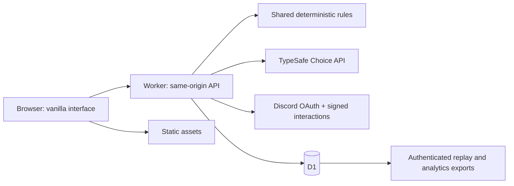

# Deployment and operation

## Local development

`npm start` launches a localhost-only Node server. It executes the same Worker handlers through a small D1-compatible SQLite adapter. SQLite uses WAL and `synchronous=FULL`; the database is never part of the distribution ZIP.

The static client can also be served independently for browser-only local practice. API absence must be visible; that mode has no trusted identity, JEV key, database or rankings. Use an HTTP localhost or HTTPS origin so Web Crypto and module workers are available; opening `index.html` directly from the filesystem is not a supported launch path.

## Hosted shape



Cloudflare Workers Static Assets, D1 and Web Crypto are used through documented native APIs. The application has no runtime npm packages. Wrangler is an optional deployment tool, not shipped application code.

### Provisioning

From the project folder:

```sh
npx wrangler d1 create dots-and-boxes
```

Copy the returned database ID into `wrangler.jsonc`. Set `APP_ORIGIN` to the exact HTTPS origin, without a trailing slash. Use the deployed domain, not the placeholder.

Set `SOURCE_REVISION` to the actual source commit identifier and `DEPLOYMENT_ID` to an operational release identifier. SOURCE_REVISION is included in the opponent cohort hash. Bump the analysis/prompt version when their semantics change.

```sh
npx wrangler d1 migrations apply dots-and-boxes --remote
npx wrangler secret put TYPESAFE_API_KEY
npx wrangler secret put DISCORD_CLIENT_SECRET
```

Add `DISCORD_CLIENT_ID` and `DISCORD_PUBLIC_KEY` to the Worker variables. The latter is Discord's public Ed25519 verification key, not the client secret. Keep the pinned `JEV_MODEL` available to your TypeSafe account.

```sh
npx wrangler deploy
```

Authenticate Wrangler through its own normal flow. No Cloudflare account or deployment was authorized during package creation. Pin the deployment-tool version in your own release workflow after its live smoke test; the package does not claim a tested Wrangler version.

### CPU and cost controls

Hard and JEV profiles expand up to 10,000 and 40,000 search nodes respectively, distributed across root candidates. They are not suitable for an assumed minimal free CPU allowance. On a plan that supports a larger CPU budget, configure and test an explicit Worker CPU limit; for example:

```json
"limits": { "cpu_ms": 30000 }
```

Verify availability and plan limits with the host before enabling high-search modes publicly. Lowering budgets changes the opponent; update its version and source revision, and do not combine the new results with the old cohort.

The server caps global provider calls at 2,000/day by default, session creation at 300/hour, authenticated match creation at 100/day, guest creation at 30/day, and session mutations at 600/hour. These are engineering defaults, not estimates of affordable usage. Set them for the deployment's budget. Quotas cannot replace provider-side billing controls or edge abuse protection.

TypeSafe cost estimates remain null unless both `INPUT_USD_PER_MILLION` and `OUTPUT_USD_PER_MILLION` are configured. Use actual account-specific rates; these values are not fetched or guessed.

## Discord application

1. Create/select a Discord application. Obtain application/client ID, OAuth client secret and application public key.
2. Add the exact OAuth redirect:

```text
https://YOUR_DOMAIN/api/auth/discord/callback
```

For localhost testing add a separate exact redirect matching `.env`:

```text
http://127.0.0.1:8787/api/auth/discord/callback
```

3. Set the interactions endpoint to:

```text
https://YOUR_DOMAIN/api/discord/interactions
```

The handler verifies Discord's Ed25519 signature before handling PING or commands, checks the application ID, and rejects timestamps outside a five-minute freshness window.

4. Register the command using a deployment-only bot token:

```sh
# Set DISCORD_CLIENT_ID and DISCORD_BOT_TOKEN in the process environment.
node scripts/register-command.mjs
```

The command is `/play`, described as Dots and Boxes. It is guild-install/guild-context only. The bot token is not needed by the running game or browser.

5. Install the application to a participating guild with the application-command scope. Invoke `/play` from an ordinary guild text channel. The private button opens an opaque, one-time link bound to the invoking Discord user, channel and guild.

User login requests only `identify`; it does not request email, messages, contacts or a guild listing. Community attribution comes from the signed interaction, not editable query parameters.

### OAuth behavior

The authorization state is single-use, expires after ten minutes, and is bound to a server session. A valid callback exchanges the code on the server, retrieves identity, stores minimal account fields, rotates the session and discards OAuth tokens. A cancelled flow does not create a logged-in account.

Production cookies use `__Host-`, `Secure`, `HttpOnly`, `SameSite=Lax` and `Path=/`. A separate CSRF token plus exact Origin checking protects mutations. Localhost development deliberately uses an unprefixed, non-Secure cookie.

## Persistence and recovery

Matches are single authoritative records updated by compare-and-swap. A gameplay revision is separate from the database record version. Opponent inference reserves a short decision lease before the provider request. A concurrent request cannot commit a second answer at the same revision.

An expired, unresolved decision lease is not silently resampled for rankings. Continuation is marked local practice and ranked eligibility is removed. Provider billing may have occurred before an interrupted process returned usage; that uncertainty remains explicit.

One active match is allowed per owner. Refresh reconnects to it. An abandoned match expires after 24 hours and is settled as a forfeit. Concession/expiration retains the actual partial board score, rather than inventing a completed 0–16 board.

Hourly cleanup expires matches, removes old sessions/OAuth states/quotas, deletes unused expired launches, removes 30-day operational logs, and removes finished unranked/practice records older than 90 days by default. Ranked records remain until an administrator applies an explicit retention policy. Export data before deleting it.

The cleanup processes at most 100 newly expired matches per run. A large backlog needs repeated runs or an operational change. It does not claim infinite-scale collection.

## Production smoke checklist

Verify HTTPS, exact-origin settings, all static assets and module workers, no browser console errors, key secrecy, successful/cancelled OAuth, one-time launch redemption, wrong-user rejection, both ranked starting seats, a complete JEV match, a provider-outage demotion, a refreshed match, replay audit, community scope isolation and quota behavior.

Inspect actual D1 row sizes and query costs. A full-evidence match can be hundreds of kilobytes; versioned 40-move games bound normal growth but do not make storage free. The included SQL provides storage and provider-failure queries.

Keep normal web-server/CDN access logs from retaining OAuth codes and launch query parameters. Application logs already exclude these values; platform-level access logging is a separate configuration responsibility.

## GoDaddy Node.js hosting

The same Worker handler also runs as a plain Node.js app (`scripts/dev.mjs`) when `NODE_ENV=production` **or** `APP_ORIGIN` is an `https://` origin on a non-loopback host (GoDaddy's platform environment can override `NODE_ENV`). Loopback or `http://` origins stay local development. GoDaddy runs `npm run build` (a no-op) then `npm start`, which loads `.env` from the zip root (real process variables win).

- Zip root holds `package.json`, `.env`, `src/`, `public/`, `scripts/`, `migrations/`. No `npm install` is needed (zero runtime dependencies).
- Production mode binds `HOST` (default `0.0.0.0`) on the platform-injected `PORT`, leaves `DEV_MODE` off so ranked play, Discord OAuth/Activity and signed interactions behave as on Workers, and refuses to start without `APP_ORIGIN` (exact `https://` origin), `TYPESAFE_API_KEY`, `DISCORD_CLIENT_ID`, `DISCORD_CLIENT_SECRET` and `DISCORD_PUBLIC_KEY`.
- The request URL is built from `APP_ORIGIN`, not the Host header, so origin/CSRF checks are unchanged behind the TLS-terminating proxy.
- SQLite lives at `DB_PATH` (default `.data/game.sqlite`, outside `public/` and never served). The filesystem is ephemeral: a redeploy loses matches, sessions and rankings.
- The Cloudflare cron is replaced by an in-process hourly timer (also run once at startup) calling the same `scheduled` cleanup.
