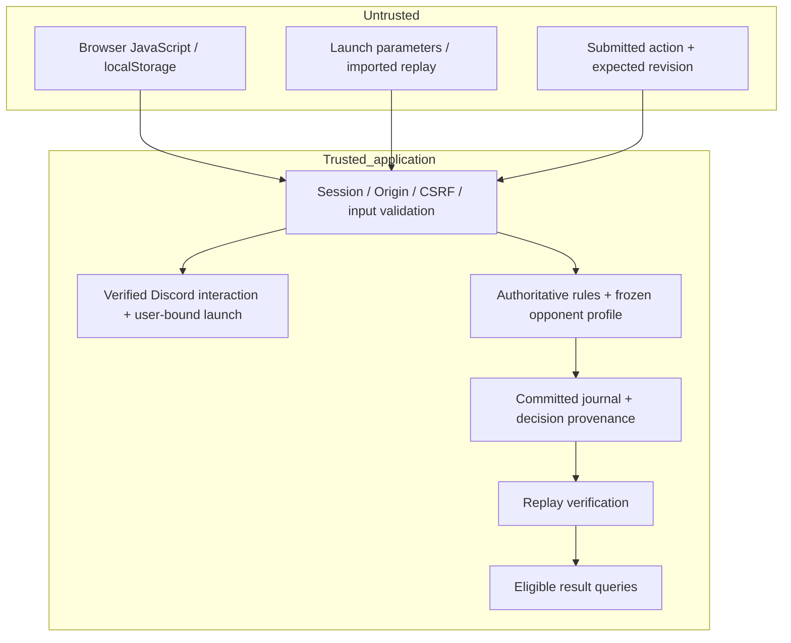

# Trust and security model

## Boundaries

The client never submits a score or chooses the official opponent's action. There is no client score-write endpoint. Backend transitions update both state and the evidence journal atomically under a record-version guard.

## Threats addressed

| Threat | Control | Residual limit |
|---|---|---|
| Changed browser score | Scores derived from authoritative box ownership | External solver assistance remains possible |
| Fabricated weak JEV replay | Server obtains and records provider decisions | The application/database operator remains trusted |
| Double click/retry | Request IDs and gameplay revision | A reused ID with a different move is rejected |
| Concurrent tabs / answer shopping | Database CAS and reserved decision lease | Interrupted provider calls may have unreported billing |
| Stale inference | Decision nonce and expected revision | Expired reservations lose ranked eligibility |
| Guild/channel spoofing | Signed interaction and one-time user-bound grant | Grant proves recent context, not permanent membership |
| OAuth/login CSRF | Expiring state bound to the initiating session | Provider login pages are outside this codebase |
| Action CSRF | Exact Origin and CSRF token | SameSite is defense in depth, not the only control |
| Session theft | Opaque token, server-side hash, HttpOnly/Secure host cookie | Browser/device compromise is outside this boundary |
| XSS from a display name | Text nodes, no name interpolation into HTML | Browser extensions can still modify the local page |
| CSV formula injection | Text beginning with formula characters is prefixed | Analysts should still treat exports as untrusted files |
| Prompt injection | Server constructs fixed questions from numeric game data | No free-text chat or user identity is sent to JEV |
| Secret leakage | No browser credentials; logs allowlist only operational fields | Upstream access-log configuration must also redact queries |
| Unlimited inference | Match ownership, turns, global/day quota, limited retries | Edge abuse protections and billing caps are still needed |

## What a hash chain proves

Every event includes the previous hash; the current hash is SHA-256 of sorted-key JSON for the event without its `hash` field. The audit checks hashes, sequence, state transitions, actor, captures, chosen-action provenance and final state.

This detects mutation relative to a retained chain head. It is **not** a digital signature, public anchor, external timestamp or guarantee against an operator who can rewrite the entire database and recompute hashes. For research requiring independent authenticity, retain exported heads with an external trusted party or add a separately reviewed signing/anchoring layer.

UTC and elapsed wall time are for cross-request presentation. `clock.monotonicMs` is comparable only within the same `clock.domainId`; Worker isolates may use different domains. Event sequence is authoritative ordering. Do not subtract monotonic values across unrelated clock domains.

## Privacy and data handling

Identity fields: Discord ID, display name, avatar reference and account timestamps. Community IDs remain in trusted attribution/session storage and are not exported in public world results or match evidence. Match IDs are pseudonymous and correlatable, not anonymous.

Required gameplay analytics contain board state, action IDs, provider evidence and operational timing. Optional UI telemetry is off by default and accepts a small fixed event vocabulary. It stores no chat, keystrokes, cursor traces, page URL, email or arbitrary text. Optional telemetry is labeled client-asserted and has no authority over outcomes.

Application request logs retain normalized route labels, method, status, duration and an enumerated error code—not raw query strings, headers or request bodies. Unknown paths are logged as `/api/unknown`. Export scripts do not include session or OAuth tables.

## Security review status

Automated checks exercise the implemented controls with local SQLite and mocked external endpoints, including real generated Ed25519 signatures. They are not an independent penetration test. Real Discord, TypeSafe account behavior, TLS, deployment proxy behavior and native browser cookie/OAuth flows require a live smoke test.

No administrative public endpoint is included. Operations exports require direct access to the database/tooling. Do not expose `.data`, `.env`, the project root, or the SQLite file through a static web server; only `public/` is static content.
